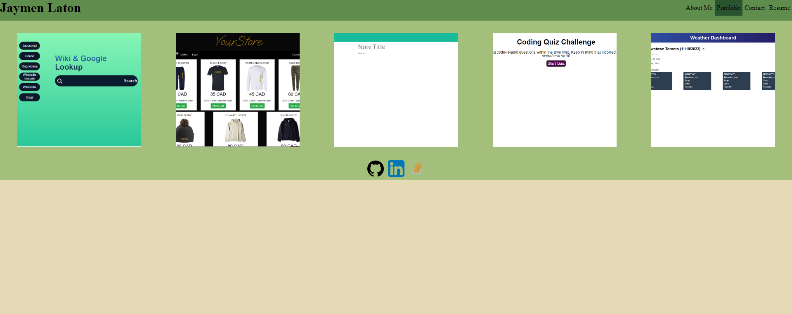

# Portfolio

## Description

This page is a portfolio for me showing various projects I worked on.

## Installation

You can access the website [here](https://canadianmre.github.io/React-Portfolio/)

## Usage

[Webpage](https://canadianmre.github.io/React-Portfolio/)

## Credits

Jaymen Laton
[Github Repo](https://github.com/CanadianMRE/React-Portfolio)

## License

None

## Questions

Visit my github at [CanadianMRE](https://github.com/CanadianMRE)
or
Contact me through email at jaymen100@gmail.com
